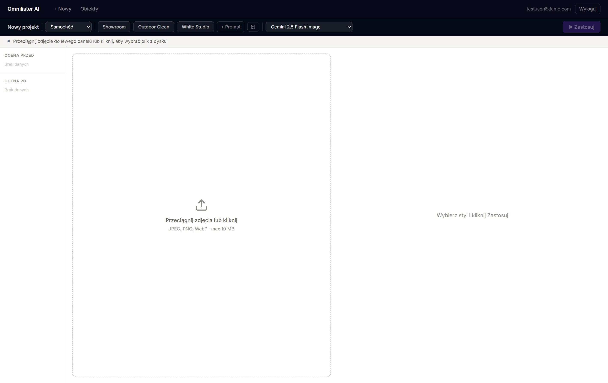
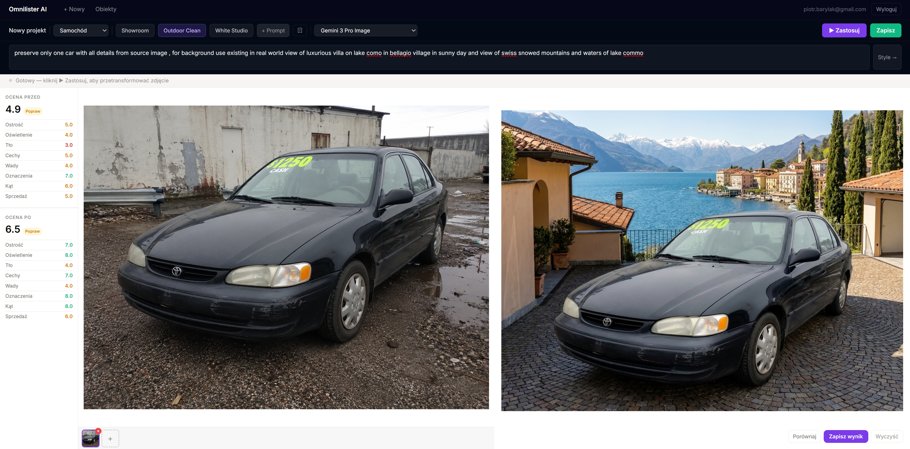
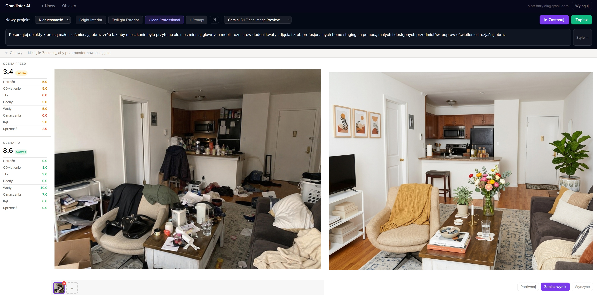

# Omnilister AI

> AI, które wie, że to konkretny samochód na Otomoto albo mieszkanie na Otodom — i poprawia zdjęcia pod cel sprzedażowy, a nie tylko pod efekt wizualny.



🔗 **Live:** [omnilister-ai.peter-be-cloud.workers.dev](https://omnilister-ai.peter-be-cloud.workers.dev)

## Czym jest Omnilister AI

Sprzedawcy na marketplace'ach (Vinted, Allegro, Otodom, Otomoto) tracą sprzedaż przez
słabe zdjęcia: źle skadrowane, nieostre, bez profesjonalnego tła. Istniejące edytory
i filtry działają **estetycznie, ale nie kontekstowo**.

Omnilister AI **ocenia, rekomenduje i transformuje** zdjęcia produktów tak, żeby obiekt
wyglądał profesjonalnie i atrakcyjnie dla kupującego — zachowując przy tym wierne
odzwierciedlenie rzeczywistych cech przedmiotu (zero halucynacji: aplikacja nie dodaje
cech, których produkt nie posiada).

### Jak to działa

1. **Biblioteka obiektów** — tworzysz obiekt (samochód / mieszkanie / rzecz), wgrywasz
   serię własnych zdjęć.
2. **Ocena jakości (quality score)** — AI ocenia każde zdjęcie na **8 wymiarach**
   (ostrość, oświetlenie, tło, cechy obiektu, uszkodzenia/defekty, napisy/etykiety,
   pokrycie kątów, sales readiness) z **wagami zależnymi od kategorii**. Próg
   „gotowe do publikacji" to **≥ 7/10**.
3. **Transformacja AI** — wybierasz gotowy styl (np. *Showroom*, *Outdoor Clean*,
   *White Studio*) lub piszesz własny prompt, a aplikacja generuje poprawioną wersję.
4. **Podgląd przed/po + gwarancja poprawy** — zapisać można tylko transformację, której
   `score_after > score_before` (niezmiennik egzekwowany po stronie serwera).
5. **Globalna biblioteka stylów** — dobre prompty publikujesz pod nazwą, dostępne dla
   wszystkich użytkowników.

## Przykłady transformacji

**Samochód** — styl *Showroom*. Ocena przed: **3.5** → po: **6.6** (tło 2.0 → 7.0,
oświetlenie 4.0 → 8.0), przy zachowaniu wszystkich cech pojazdu.



**Nieruchomość** — styl *Homestage*: profesjonalne uprzątnięcie i doświetlenie wnętrza.



## Wynik analizy MVP (10xBuilder)

Projekt został przeanalizowany względem minimalnych wymagań technicznych bloku 10xBuilder.

**Status: 5/5 = 100% ✅**

| # | Kryterium | Status | Dowód |
|---|-----------|--------|-------|
| 1 | **CRUD** | ✅ | `objects` (C/R/U) + `photos` (C/R/D) na trwałych danych Supabase — `src/pages/api/objects/**` |
| 2 | **Logika biznesowa** | ✅ | Ważony quality score na 8 wymiarach (`src/lib/quality-scoring.ts`) + niezmiennik `score_after > score_before` |
| 3 | **Testy adresujące ryzyko** | ✅ | Plan: `context/foundation/test-plan.md` (7 ryzyk); testy mapują Risk #3/#4/#5 (`tests/integration/**`) |
| 4 | **Uwierzytelnianie per użytkownik** | ✅ | Supabase Auth + `src/middleware.ts`; zasoby zakresowane `.eq("user_id", …)`, RLS zweryfikowane testem IDOR |
| 5 | **Dokumentacja** | ✅ | Fundament w `context/foundation/` (PRD, roadmap, tech-stack, test-plan) + ten README |

> Drobne usprawnienie do rozważenia: dodanie endpointu `DELETE /api/objects/[objectId]`
> (dziś `objects` mają C/R/U, a usuwanie kaskadowo dotyczy zdjęć) — dla jednoznacznego
> kompletu CRUD na jednej encji.

## Stack technologiczny

- [Astro](https://astro.build/) v6 — framework z renderowaniem server-first
- [React](https://react.dev/) v19 — interaktywne komponenty (edytor)
- [TypeScript](https://www.typescriptlang.org/) v5 — type-safe
- [Tailwind CSS](https://tailwindcss.com/) v4 — warstwa stylów
- [Supabase](https://supabase.com/) — Auth, Postgres (RLS) i Storage
- [OpenRouter](https://openrouter.ai/) — dostęp do modeli AI (vision + transformacja obrazu)
- [Cloudflare Workers](https://workers.cloudflare.com/) — deployment na edge

## Prerequisites

- Node.js v22.14.0 (zgodnie z `.nvmrc`)
- npm

## Getting Started

1. Sklonuj repozytorium:

```bash
git clone https://github.com/piotrbary/10x-Omnilister-AI.git
cd 10x-Omnilister-AI
```

2. Zainstaluj zależności:

```bash
npm install
```

3. Skonfiguruj Supabase i zmienne środowiskowe — patrz [Supabase Configuration](#supabase-configuration).

4. Utwórz plik `.dev.vars` z sekretami dla lokalnego Cloudflare dev:

```bash
cp .env.example .dev.vars
```

Ustaw też `OPENROUTER_API_KEY` (jedyny klucz wymagany dla funkcji AI).

5. Uruchom serwer deweloperski:

```bash
npm run dev
```

## Available Scripts

- `npm run dev` — serwer deweloperski (runtime Cloudflare workerd)
- `npm run build` — build produkcyjny
- `npm run preview` — podgląd buildu produkcyjnego
- `npm run test` — testy (Vitest)
- `npm run lint` — ESLint z regułami type-checked
- `npm run lint:fix` — auto-fix ESLint
- `npm run format` — Prettier
- `npm run deploy` — deploy na Cloudflare Workers (uruchom `npm run build` najpierw)

## Project Structure

```md
.
├── src/
│ ├── layouts/      # Astro layouts
│ ├── pages/        # Astro pages
│ │ └── api/        # API endpoints (objects, photos, styles, transformations, auth)
│ ├── components/   # UI (Astro & React) — edytor, biblioteka obiektów, auth
│ ├── lib/          # Logika domenowa (quality-scoring, transformation-processor, openrouter)
│ └── types/        # Typy TypeScript (w tym database.generated.ts)
├── tests/          # Testy integracyjne (risk-first)
├── context/        # Fundament 10x (PRD, roadmap, test-plan, …)
├── public/         # Public assets
└── wrangler.jsonc  # Cloudflare Workers config
```

## Supabase Configuration

Projekt używa [Supabase](https://supabase.com/) do uwierzytelniania, bazy Postgres (z RLS)
oraz Storage na zdjęcia. Zmienne środowiskowe deklarowane są przez schemat `astro:env`
i traktowane jako **server-only secrets** — nigdy nie trafiają do klienta.

### Cloud Supabase

Dodaj do `.env` i `.dev.vars`:

| Variable             | Description                                                |
| -------------------- | ---------------------------------------------------------- |
| `SUPABASE_URL`       | Project URL z Supabase dashboard → Settings → API          |
| `SUPABASE_KEY`       | `anon` public key z Supabase dashboard → Settings → API    |
| `OPENROUTER_API_KEY` | Klucz API z [openrouter.ai](https://openrouter.ai/) (AI)   |

```
SUPABASE_URL=https://<project-ref>.supabase.co
SUPABASE_KEY=<anon-key>
OPENROUTER_API_KEY=<openrouter-key>
```

### Auth routes

| Route                 | Description                                                  |
| --------------------- | ----------------------------------------------------------- |
| `/auth/signin`        | Logowanie email/hasło                                       |
| `/auth/signup`        | Rejestracja email/hasło                                     |
| `/auth/confirm-email` | Strona „sprawdź skrzynkę" po rejestracji                    |
| `/dashboard`          | Strona chroniona (przekierowuje na `/auth/signin`)          |

Ochrona tras jest w `src/middleware.ts` (tablica `PROTECTED_ROUTES`).

## Deployment

Projekt deployuje się na [Cloudflare Workers](https://workers.cloudflare.com/).

```bash
npm run build
npm run deploy
```

Ustaw `SUPABASE_URL`, `SUPABASE_KEY` i `OPENROUTER_API_KEY` jako sekrety w Cloudflare
(`npx wrangler secret put <NAME>`).

## License

MIT
