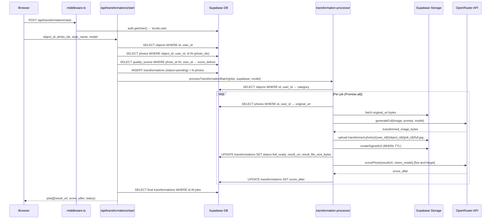
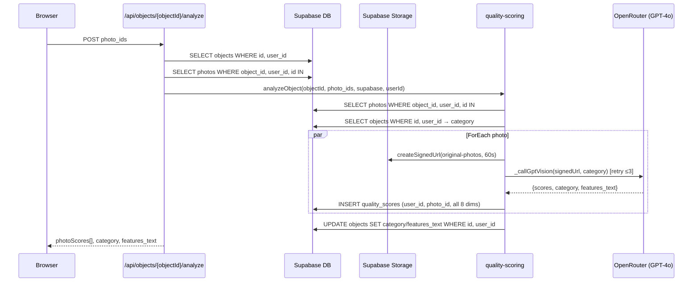
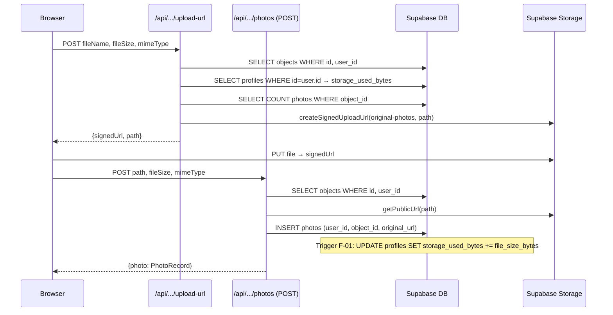

# Research: Supabase data flows, API calls, test coverage, blast radius

**Date**: 2026-06-25  
**Researcher**: Claude Sonnet 4.6  
**Git Commit**: `06218b988ceb15d9f4a7ba6acb148e2b24eaafc7`  
**Branch**: `UX_REDESIGN`  
**Repository**: piotrbary/10x-Omnilister-AI

## Research Question

Przeanalizuj procesy zapisu i odczytu danych z Supabase oraz wywołań API, zwracając szczególną uwagę na obszary zdefiniowane w `context/map/repo-map.md`. Trzech równoległych agentów: (1) E2E trace, (2) luki w testach, (3) blast radius.

---

## Feature Overview

Omnilister AI to aplikacja do AI-wspomaganej transformacji zdjęć produktowych. Dane przepływają przez trzy niezależne potoki z jednym wspólnym węzłem DB: `supabase.ts`.

### Przepływy produktowe (12 flows)

| Flow | Ścieżka | Supabase ops | AI call |
|------|---------|--------------|---------|
| F-1: Guest transform | EditorShell → `/api/transformations/guest` → openrouter-images | Brak | OpenRouter (1–2 calle) |
| F-2: Auth transform | EditorShell → `/api/transformations/start` → transformation-processor | 8 operacji DB + 2 Storage | OpenRouter (image + optionally vision) |
| F-3: Photo analysis | `/api/objects/[objectId]/analyze` → quality-scoring | 4 operacji DB + 1 Storage | OpenRouter vision (GPT-4o) |
| F-4a: Upload URL | `/api/objects/[objectId]/photos/upload-url` | 3 SELECT, 1 Storage createSignedUploadUrl | Brak |
| F-4b: Confirm upload | `/api/objects/[objectId]/photos` (POST) | 1 SELECT, 1 INSERT + trigger F-01 | Brak |
| F-5: Photo delete | `/api/objects/[objectId]/photos/[photoId]` (DELETE) | 1 SELECT, 1 DELETE + trigger | 1 Storage remove |
| F-6: Auth (signin/signup/signout) | `/api/auth/*` | Supabase Auth + trigger na signup | Brak |
| F-7: Object CRUD | `/api/objects`, `/api/objects/[objectId]` | SELECT/INSERT/UPDATE | Brak |
| F-8: Styles | `/api/styles/*` | SELECT/INSERT | Brak |
| F-9: Feedback | `/api/transformations/[jobId]/feedback` | 1 SELECT, 1 UPDATE | Brak |
| F-10: Status poll | `/api/transformations/status?ids=...` | 1 SELECT | Brak |
| F-11: Save result | `/api/transformations/[jobId]/save` | 2 SELECT, 1 UPDATE + trigger F-02 | Brak |

### Kluczowy węzeł — `src/lib/supabase.ts`

28 linii. Jedyna fabryka klienta DB. Zwraca `null` gdy `SUPABASE_URL` lub `SUPABASE_KEY` są falsy — każdy z 21 callerów obsługuje `null` samodzielnie (18 plików `.ts`/`.tsx` + 3 pliki `.astro`: `objects/index.astro`, `objects/[objectId]/transform.astro`, `objects/[objectId].astro` — poza zasięgiem dep-cruiser).

---

## E2E Trace — najważniejsze ścieżki

### F-2: Auth transform (najdłuższy flow)



**Operacje DB w F-2:**

| Krok | Tabela | Operacja | Filtry (user_id?) |
|------|--------|----------|-------------------|
| ownership check | objects | SELECT | id, user_id ✅ |
| ownership check | photos | SELECT | object_id, user_id, id IN ✅ |
| score_before | quality_scores | SELECT | photo_id IN, user_id ✅ |
| create jobs | transformations | INSERT | user_id, object_id, photo_id ✅ |
| get category | objects | SELECT | id, user_id ✅ |
| get photo | photos | SELECT | id, user_id ✅ |
| log step | transformations | UPDATE | id, user_id ✅ |
| set full_ready | transformations | UPDATE | id, user_id ✅ |
| set score_after | transformations | UPDATE | id, user_id ✅ |
| final fetch | transformations | SELECT | id IN (no user_id) ⚠️ |

### F-3: Photo analysis



### F-4a+b: Upload flow (z triggerem F-01)



---

## Luki w testach

### Stan infrastruktury

- **Framework**: Vitest 4.1.7 (`npm run test` → `vitest run`)
- **Pliki testowe**: 2 pliki, 176 linii

| Plik | Linie | Co testuje |
|------|-------|-----------|
| `src/lib/quality-scoring.test.ts` | 156 | `_callGptVision` retry loop, `scorePhoto`, częściowo `analyzeObject` |
| `src/lib/transformation-styles.test.ts` | 20 | `buildPrompt` — guardrail appending, custom override |

### Mapa pokrycia

| Plik | Pokrycie | Opis |
|------|----------|------|
| `src/middleware.ts` | ❌ 0% | PROTECTED_ROUTES check, redirect, user assignment — brak testów |
| `src/pages/api/auth/signin.ts` | ❌ 0% | JSON/form parsing, signInWithPassword — brak testów |
| `src/pages/api/auth/signup.ts` | ❌ 0% | signUp, confirm-email redirect — brak testów |
| `src/pages/api/transformations/start.ts` | ❌ 0% | Ownership chain, Zod validation, batch insert, delegate — brak testów |
| `src/pages/api/transformations/guest.ts` | ❌ 0% | No-auth path, base64 encode/decode, generateFull — brak testów |
| `src/lib/transformation-processor.ts` | ❌ 0% | Retry loop, Storage upload, fire-and-forget scorePhoto — brak testów |
| `src/lib/openrouter-images.ts` | ❌ 0% | Two-step vs single-step branching, enhancePrompt, generateImage — brak testów |
| `src/pages/api/objects/[objectId]/analyze.ts` | ❌ 0% | Ownership chain, partial-failure handling (allFailed check) — brak testów |
| `src/lib/quality-scoring.ts` | ⚠️ ~40% | `_callGptVision` retry OK; `analyzeObject` (DB insert, signed URL, category merge) — brak |
| `src/lib/transformation-styles.ts` | ⚠️ ~30% | `buildPrompt` OK; `buildPromptFromRaw` — brak testów |
| `src/pages/api/transformations/[jobId]/save.ts` | ❌ 0% | Storage limit pre-check, status transition full_ready→saved — brak testów |
| Pozostałe 7 tras API | ❌ 0% | — |

### Krytyczne gałęzie bez pokrycia

```
src/lib/openrouter-images.ts:148–163  — supportsImageOutput branching (1-step vs 2-step)
src/lib/transformation-processor.ts:41–157 — retry state machine (success/fail/partial)
src/pages/api/transformations/start.ts:40–64 — ownership verification failure paths
src/pages/api/objects/[objectId]/photos/index.ts:105–120 — quota constraint error (23514)
src/lib/quality-scoring.ts:240–284 — per-photo error handling w Promise.allSettled
src/pages/api/transformations/[jobId]/save.ts:32–58 — storage limit enforcement
src/middleware.ts:18–21 — redirect on unauth access to PROTECTED_ROUTES
```

**Werdykt:** Pokrycie **MINIMALNE (<5%)**. Żadna z 17 tras API nie ma testu. Auth flow, ownership verification, AI pipeline — niesprawdzone.

---

## Blast Radius

### Schematy Zod — szwy interfejsu

| Schema | Plik:linia | Callery | Ryzyko zmiany |
|--------|-----------|---------|---------------|
| `StartTransformationRequestSchema` | `types/transformations.ts:39` | `start.ts:30` | Zmiana pola → 400 errors u klientów |
| `FeedbackRequestSchema` | `types/transformations.ts:49` | `feedback.ts:23` | Enum tied to DB CHECK constraint |
| `AnalyzeBodySchema` | `types/analysis.ts` | `analyze.ts` | photo_ids validation |

### Typy TypeScript — kontrakty

| Typ | Ryzyko |
|-----|--------|
| `TransformationStatus` | Synchronizacja z DB CHECK constraint + app logic — 3 miejsca jednocześnie |
| `QualityScoreSnapshot` | Przechowywana jako JSONB w `score_before`/`score_after` — zmiana kształtu wymaga migracji JSON |
| `ObjectCategory` | DB CHECK + PRESET_STYLES + scoring weights + RLS policies — 4 miejsca |

### Wygenerowane warstwy

| Warstwa | Generowana przez | Ryzyko |
|---------|-----------------|--------|
| `src/types/database.generated.ts` | `supabase gen types typescript` | **KRYTYCZNE** — ręczna regeneracja po każdej migracji. Zapomnienie → desync typów. |

### Triggery DB — krytyczne sprzężenia

**Trigger F-01: `on_photo_storage_change`**  
Plik: `supabase/migrations/20260530000000_initial_schema.sql`  
Uruchomienie: `photos` AFTER INSERT OR DELETE  
Efekt: `UPDATE profiles SET storage_used_bytes += / -= file_size_bytes WHERE id = user_id`

Sprzężone z:
- `src/pages/api/objects/[objectId]/photos/upload-url.ts` — pre-check storage quota PRZED insertem
- `src/pages/api/objects/[objectId]/photos/index.ts` — INSERT fires trigger
- `src/pages/api/objects/[objectId]/photos/[photoId].ts` — DELETE fires trigger

**Trigger F-02: `on_transformation_storage_change`**  
Plik: `supabase/migrations/20260530000000_initial_schema.sql` + `20260530000004_fix_transformation_trigger_fallthrough.sql`  
Uruchomienie: `transformations` AFTER UPDATE OR DELETE  
Efekt: Na `status = 'saved'`: `storage_used_bytes += result_file_size_bytes`

Sprzężone z:
- `src/pages/api/transformations/[jobId]/save.ts:40–58` — pre-check PRZED UPDATE
- `src/lib/transformation-processor.ts:105–115` — ustawia `result_file_size_bytes` przy `full_ready`

### Scenariusze zmian — co musi się zmienić razem

| Scenariusz | Pliki MUST change |
|------------|------------------|
| **A: Zmiana domyślnego modelu AI** | `config.ts:59`, `openrouter-images.ts:156`; weryfikacja czy nowy model jest w TRANSFORMATION_MODELS z poprawnym `supportsImageOutput` |
| **B: Nowy status transformacji** | `types/transformations.ts:3`, migracja DB (DROP + ADD CHECK constraint), `save.ts:32`, trigger F-02 (jeśli nowy status wpływa na storage) |
| **C: Nowa kolumna w `transformations`** | migracja SQL, `supabase gen types` → `database.generated.ts`, `transformation-processor.ts` (INSERT/UPDATE), `types/transformations.ts` jeśli eksponowana |
| **D: Zmiana sygnatury `generateFull()`** | `openrouter-images.ts:141`, `transformation-processor.ts:81`, `guest.ts:44` — obydwa callsites |
| **E: Zmiana limitu storage 100MB→200MB** | `config.ts:9,11` + migracja SQL (DROP/ADD CHECK constraint na `profiles`) |

### Co-change blast radius (z historii gita)

| Zmiana | Historycznie zmieniane razem |
|--------|------------------------------|
| `config.ts` | `openrouter-images.ts`, `transformation-processor.ts`, `start.ts`, `EditorShell.tsx`, `TransformToolbar.tsx` |
| `transformation-processor.ts` | `openrouter-images.ts`, `quality-scoring.ts`, `start.ts` |
| `openrouter-images.ts` | `transformation-processor.ts`, `guest.ts` (blind spot) |
| `types/transformations.ts` | `transformation-processor.ts`, `start.ts`, `status.ts`, `database.generated.ts` |

---

## Technical Debt

### TD-1: `MOCK_SCORE_BEFORE` bezwarunkowy w produkcji ❗

**Plik:** `src/components/editor/EditorShell.tsx:2, 686`  
**Problem:** `import { MOCK_SCORE_BEFORE }` jest bezwarunkowy (brak `import.meta.env.DEV`). Linia 686: `<ScoreSidebar scoreBefore={MOCK_SCORE_BEFORE} scoreAfter={scoreAfter} />` — wartość `5.8` jest zawsze używana jako `scoreBefore`, niezależnie od rzeczywistego wyniku jakości zdjęcia przed transformacją. UI porównuje mockowy "wynik przed" z prawdziwym "wynikiem po". Dezinformuje użytkownika.

---

### TD-2: Brak filtra `user_id` w dwóch zapytaniach ⚠️

**Plik 1:** `src/pages/api/objects/[objectId]/index.ts:71–75`  
```typescript
await supabase.from("photos").select("...").eq("object_id", objectId)
// BRAK: .eq("user_id", user.id)
```

**Plik 2:** `src/pages/api/quality-scores/photo/[photoId].ts:33–41`  
```typescript
await supabase.from("quality_scores").select("...").eq("photo_id", photoId)
// BRAK: .eq("user_id", user.id)
```

> **Doprecyzowanie (ast-grep, 2026-06-26):** Plik 2 ma pre-check ownership przez `photos` (linie 22–27: `.eq("user_id", user.id)` na tabeli `photos`) — nie jest to "tylko RLS". Sama query `quality_scores` wciąż brakuje filtra `user_id`. Plik 1 (`objectId/index.ts`) nie ma żadnego pre-checku dla photos — guard = wyłącznie RLS. Per `lessons.md`: "Apply user_id filter on every query, even when ownership is implied."

---

### TD-3: `guest.ts` bez rate limiting, logi tracone ⚠️

**Plik:** `src/pages/api/transformations/guest.ts:25–26`  
Komentarz w kodzie: `// ponytail: no auth check — unauthenticated transforms. Add IP rate limiting if abuse occurs.`

Dodatkowy problem: `generateFull(imageBytes, prompt, body.mimeType, [], model)` — pusty tablica `[]` zamiast przekazanego bufora logów. Błędy AI przy guest transformacjach są tracone.

---

### TD-4: Synchroniczne przetwarzanie transformacji — ryzyko timeout ⚠️

**Plik:** `src/pages/api/transformations/start.ts:137`  
```typescript
await processTransformationBatch(jobs, supabase, model); // synchronous
```

Przy `aiConfig.maxRetries=2` i `transformationTimeoutMs=60_000`: max 3 × 60s = 180s na request. Cloudflare Workers ma 60s CPU time limit (nie wall-clock na paid plan, ale wall-clock timeout może być problem). Brak queue, brak background processing.

---

### TD-5: Wygasające signed URLs (24h TTL) ❗

**Plik:** `src/lib/transformation-processor.ts:97–101`  
```typescript
supabase.storage.from("transformed-photos").createSignedUrl(fullPath, 86400)
```

`result_url` zapisany w DB ma TTL 86400s (1 dzień). Po dobie URL wygasa — UI pokazuje broken image. `score_after` w F-2 pobiera scoring przez ten URL zaraz po wygenerowaniu (OK), ale każdy kolejny odczyt z DB jest potencjalnie broken.

---

### TD-6: Ekstrakcja ścieżki storage przez segmentowanie URL ⚠️

**Plik:** `src/pages/api/objects/[objectId]/photos/[photoId].ts:33–35`  
```typescript
const segments = photoRow.original_url.split("/");
const storagePath = segments.slice(-3).join("/"); // user_id/object_id/filename
```

Per `lessons.md`: "Reconstruct storage paths from trusted values, not public URLs." Segment slicing jest kruche — zmiana formatu CDN URL lub dodanie segmentu łamie ekstrakcję. Prawidłowe podejście: `fileName = path.split('/').at(-1)`, path = `` `${user.id}/${objectId}/${fileName}` ``.

---

### TD-7: Podwójny ownership check w F-3 (duplicate DB calls) 🔵

**Plik:** `src/pages/api/objects/[objectId]/analyze.ts` vs `src/lib/quality-scoring.ts`  

API route sprawdza ownership objects + photos (linie 43–68), następnie `analyzeObject()` sprawdza je ponownie (linie 194–210). Cztery redundantne SELECT wywołania per żądanie analizy.

---

### TD-8: `TRANSFORMATION_MODELS` zawiera spekulatywne modele 🔵

**Plik:** `src/lib/config.ts:27–44`  
Tablica zawiera `google/gemini-3.1-flash-image`, `openai/gpt-5-image`, `openai/gpt-5.4-image-2` — modele które prawdopodobnie nie istnieją w OpenRouter. Wybór takiego modelu przez użytkownika spowoduje błąd 400/404 z OpenRouter bez czytelnego komunikatu w UI.

---

### TD-9: Race condition w concurrent save ⚠️

**Plik:** `src/pages/api/transformations/[jobId]/save.ts:40–65`  
Pre-check (SELECT profiles → sprawdź quota) i trigger F-02 (UPDATE profiles) nie są w transakcji. Dwa równoległe żądania save mogą przejść pre-check jednocześnie przed zaktualizowaniem licznika — oba przekroczą limit. Backstop: CHECK constraint na poziomie DB (`storage_used_bytes <= 104857600`) rzuci błąd 23514, ale bez obsługi tego kodu w aplikacji.

---

### TD-10: Brak obsługi błędu 23514 (storage quota exceeded) 🔵

**Plik:** `src/pages/api/objects/[objectId]/photos/index.ts:108–119`  
INSERT do `photos` może rzucić `23514` (CHECK constraint violation na `profiles.storage_used_bytes`), gdy race condition pozwoli przekroczyć limit. Błąd nie jest obsługiwany jako czytelny komunikat — użytkownik dostanie generyczne 500.

---

## Kod — kluczowe referencje

| Plik:linia | Opis |
|-----------|------|
| `src/lib/supabase.ts:9–27` | Jedyna fabryka klienta DB — zwraca null gdy brak kluczy |
| `src/middleware.ts:4` | PROTECTED_ROUTES hardcoded — `/app/editor` nie jest chroniony |
| `src/lib/config.ts:24–44` | TRANSFORMATION_MODELS — runtime branching przez `supportsImageOutput` |
| `src/lib/config.ts:59` | `aiConfig.transformationModel` — domyślny model AI |
| `src/lib/config.ts:71` | `aiConfig.visionModel = "openai/gpt-4o"` — oddzielny model do scoringu |
| `src/lib/config.ts:9` | `storageConfig.Max_Client_Repository` — komentarz ostrzega o migracji przy zmianie |
| `src/lib/openrouter-images.ts:141–166` | `generateFull` — implementacja two-step vs single-step flow |
| `src/lib/openrouter-images.ts:148` | `TRANSFORMATION_MODELS.find(m => m.id === model)?.supportsImageOutput ?? false` |
| `src/lib/transformation-processor.ts:9` | `processTransformationBatch(jobs, supabase, model?)` — SupabaseClient jako parametr (unit-testowalny) |
| `src/lib/transformation-processor.ts:117–122` | `scorePhoto` fire-and-forget — błąd scoringu nie blokuje transformacji |
| `src/lib/quality-scoring.ts:64–76` | `computeOverall` — weighted average, wszystkie wagi = 1 (TODO: kalibracja per kategoria) |
| `src/components/editor/EditorShell.tsx:2` | `import { MOCK_SCORE_BEFORE }` — bezwarunkowy import w produkcji |
| `src/components/editor/EditorShell.tsx:686` | `scoreBefore={MOCK_SCORE_BEFORE}` — zawsze mock 5.8 |
| `src/pages/api/transformations/guest.ts:25` | `// ponytail: no auth check` + brak rate limiting |
| `src/pages/api/transformations/[jobId]/save.ts:60` | `// F-01 trigger increments storage_used_bytes` — komentarz dokumentuje trigger coupling |
| `supabase/migrations/20260530000000_initial_schema.sql:35–47` | Trigger F-01 definition |
| `supabase/migrations/20260530000000_initial_schema.sql:51–75` | Trigger F-02 definition |
| `supabase/migrations/20260602000001` | Usuwa `draft_ready` status — architektoniczna decyzja: sync processing |

---

## Tabela użycia tabel Supabase (cross-flow)

| Tabela | Flows czytające | Flows piszące |
|--------|----------------|---------------|
| objects | F-2, F-3, F-4a, F-4b, F-7a, F-7c | F-3 (UPDATE category), F-7b, F-7d |
| photos | F-2, F-3, F-4a, F-7c | F-4b (INSERT + trigger F-01), F-5 (DELETE + trigger) |
| transformations | F-2 (INSERT + UPDATE), F-9, F-10, F-11 | F-2, F-11 |
| quality_scores | F-2 (score_before), F-12 | F-3 (INSERT per photo) |
| profiles | F-4a (quota check), F-4b, F-11 | F-4b (via trigger F-01), F-5 (via trigger), F-11 (via trigger F-02) |
| styles | F-8a | F-8b |
| auth.users | F-6a, F-6b | F-6b (signUp), F-6c (signOut) |

---

## Open Questions

1. **`/app/editor` nie jest w PROTECTED_ROUTES** — czy auth jest w `editor.astro` (niezbadane), czy edytor celowo jest dostępny bez logowania (wspiera guest mode)?
2. **`aiConfig.visionModel = "openai/gpt-4o"`** — czy planowana migracja do Gemini dla scoringu, skoro transformacje już używają Gemini?
3. **Signed URL TTL 86400s** — czy UI odświeża `result_url` po wygaśnięciu? Jeśli nie, saved transformacje stają się broken po dobie.
4. **Trigger F-04 (auth → profiles)** — komentarz w `supabase.ts:6–8` sugeruje self-heal pattern. Czy trigger kiedykolwiek fail? Czy self-heal jest zaimplementowany?
5. **`TRANSFORMATION_MODELS` spekulatywne modele** — skąd lista? Czy weryfikowana pod kątem dostępności w OpenRouter?
6. **`computeOverall` — wszystkie wagi = 1** — komentarz "Calibrate per category before public launch". Czy to blokuje launch?
7. **E2E tests** — czy planowane są testy Playwright dla krytycznych flows (auth, transform, save)?

---

## Weryfikacja strukturalna (ast-grep, 2026-06-26)

Twierdzenia strukturalne z raportu zweryfikowane narzędziami `ast-grep` i `grep` na bieżącym stanie brancha `UX_REDESIGN`.

| # | Twierdzenie | Wynik | Szczegóły |
|---|-------------|-------|-----------|
| 1 | `generateFull()` — 2 callsites: `transformation-processor.ts:81`, `guest.ts:44` | ✅ **potwierdzone** | ast-grep trafił oba dokładnie |
| 2 | `scorePhoto` fire-and-forget — try/catch bez rethrow | ✅ **potwierdzone** | `transformation-processor.ts:118–122`: `try { scoreAfter = await scorePhoto(...) } catch { }` |
| 3 | `processTransformationBatch` — 1 callsite (`start.ts:137`) | ✅ **potwierdzone** | ast-grep: tylko `start.ts:137` |
| 4 | `Promise.allSettled` w `analyzeObject` | ✅ **potwierdzone** | `quality-scoring.ts:227` |
| 5 | `Promise.all(jobs.map(...))` w `processTransformationBatch:25` | ✅ **potwierdzone** | `transformation-processor.ts:25` |
| 6 | `createSignedUrl` TTL=86400s | ✅ **potwierdzone** | `transformation-processor.ts:99`; dodatkowe `.createSignedUrl(photo.original_url, 60)` w `quality-scoring.ts:220` (scoring — 60s, różne TTL) |
| 7 | `MOCK_SCORE_BEFORE` — import linia 2, użycie linia 686 | ✅ **potwierdzone** | `EditorShell.tsx:2` i `:686` — bezwarunkowy |
| 8 | `NO_DISTORTION_GUARDRAIL` appended to every prompt | ✅ **potwierdzone** | `transformation-styles.ts:90` (`buildPromptFromRaw`) i `:103` (`buildPrompt`) — obie ścieżki |
| 9 | `supportsImageOutput` — runtime branching w `openrouter-images.ts:148–158` | ✅ **potwierdzone** | linie 149, 156, 158 |
| 10 | `aiConfig.visionModel = "openai/gpt-4o"` (`config.ts:71`) | ✅ **potwierdzone** | `config.ts:71` |
| 11 | `aiConfig.maxRetries = 2`, `while (true)` retry loop | ✅ **potwierdzone** | `config.ts:68`, `transformation-processor.ts:50` |
| 12 | `PROTECTED_ROUTES = ["/dashboard", "/objects"]` — `/app/editor` nie chroniony | ✅ **potwierdzone** | `middleware.ts:4` |
| 13 | `EditorShell` fan-out = 9 | ✅ **potwierdzone** | 9 runtime (non-type) importów; type-only (`import type`) dep-cruiser nie liczy |
| 14 | `enhancePrompt()` i `generateImage()` — private (non-exported) | ✅ **potwierdzone** | `openrouter-images.ts:17,75` — brak `export` prefix; `generateFull` eksportowana `:141` |
| 15 | `generateFull` zwraca `{ url: "", buffer }` — `url` zawsze pusty | ✅ **potwierdzone** | `openrouter-images.ts:166` |
| 16 | TD-2: brak `user_id` w photos query (`objectId/index.ts:74`) | ✅ **potwierdzone** | tylko `.eq("object_id", objectId)`, brak pre-checku dla photos |
| 17 | TD-2: brak `user_id` w `quality_scores` query | ✅ **doprecyzowane** | query brakuje `user_id` ✓, ale endpoint MA pre-check ownership przez `photos` (linie 22–27) — nie "wyłącznie RLS" |
| 18 | TD-6: storage path przez `segments.slice(-3)` | ✅ **potwierdzone** | `photos/[photoId].ts:34–35` |
| 19 | `supabase.ts` fan-in = 18 | ✅ **doprecyzowane** | 18 plików `.ts`/`.tsx` (dep-cruiser) + 3 pliki `.astro` (dep-cruiser blind-spot) = **21 callerów łącznie** |
| 20 | `config.ts` fan-in = 15 | ❌ **obalone** | grep: 18 via `@/lib/config` + 3 via `./config` (lib files) = **21 importerów**; liczba 15 z dep-cruiser była nieaktualna (snapshot sprzed dodania komponentów na branchu UX_REDESIGN) |
