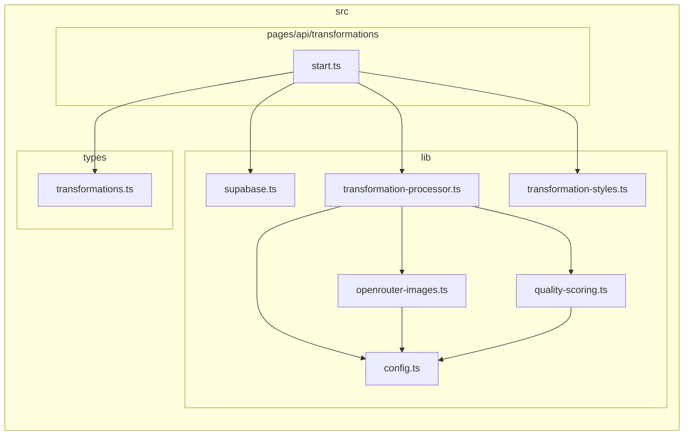

# Artifact 2 — Structure Analysis

> Narzędzie: dependency-cruiser v17.4.3. Branch: `UX_REDESIGN`. Data: 2026-06-24.
> Zakres: pełny skan `src/`. Poprzedni artifact: `artifact-1-territory.md`.
> Szczegółowe dane techniczne: `artifact-2-dependency-analysis.md`.

---

## Co zostało zrobione

1. Zainstalowano `dependency-cruiser@17.4.3` + Graphviz
2. Napisano `.dependency-cruiser.cjs` z regułami warstw dla tego projektu
3. Przeanalizowano cykle, granice warstw i ryzyka testowalności
4. Wygenerowano grafy SVG i Mermaid do `context/map/`

---

## Mapa warstw

```
UX:components  (31 modułów)
   ↓ imports
LIB:logic      (5 modułów: config, supabase-wrapper, transformation-styles, utils, quality-scoring)
   ↑ also imported by
API:routes     (19 modułów)
   ↓ imports
DB:client      (1 moduł: supabase.ts)   ← fan-in=18
EXT:ai         (4 moduły: openrouter-images, transformation-processor, quality-scoring, quality-scoring.test)
MW:auth        (1 moduł: middleware.ts)
TYPES          (4 moduły)
```

---

## Cykle zależności

**Wynik: 0 cykli.** Projekt w dobrej kondycji strukturalnej.

---

## Granice warstw — co respektowane, co nie

| Granica | Status | Uwaga |
|---------|--------|-------|
| UX → DB:client | ✅ czyste | Żaden komponent nie dotyka Supabase |
| UX → EXT:ai | ✅ czyste | Żaden komponent nie wywołuje OpenRouter |
| LIB → UX | ✅ czyste | Lib nie importuje komponentów |
| API → UX:components | ✅ czyste | Trasy API nie importują komponentów |
| UX → LIB:config | ⚠️ szara strefa | 6 komponentów importuje `config.ts` bezpośrednio |
| API → DB | ℹ️ płaski dostęp | 17 tras importuje `supabase.ts` — brak serwisu |
| AI pipeline | 🔴 rozgałęziony | 3 osobne ścieżki wywołania AI (patrz niżej) |
| Mock w produkcji | 🔴 ryzyko | `EditorShell.tsx` importuje `mockEditorData.ts` |

---

## Trzy ścieżki do AI pipeline

```
start.ts   → transformation-processor.ts → openrouter-images.ts  [dla zalogowanych]
guest.ts   → openrouter-images.ts                                  [dla gości, omija procesor]
analyze.ts → quality-scoring.ts                                    [scoring, osobna domena]
```

Zmiana modelu AI wymaga aktualizacji wszystkich trzech. `guest.ts` jest nowym plikiem niewidocznym w historii git — najłatwiej pominąć.

---

## Hubs strukturalne

| Moduł | Fan-in | Znaczenie |
|-------|--------|-----------|
| `src/lib/supabase.ts` | **18** | Każda trasa API tworzy klienta bezpośrednio — brak repozytorium |
| `src/lib/config.ts` | **15** | Obecny we wszystkich warstwach; #1 hot file w git (5×) |
| `src/lib/transformation-styles.ts` | 5 | Importowany przez UI i API |
| `src/components/editor/EditorShell.tsx` | fan-out=**9** | Najwyższy fan-out; ciągnie cały ekosystem edytora |

---

## Ryzyka testowalności — ranking

| # | Moduł | Ryzyko | Zalecany test |
|---|-------|--------|---------------|
| 1 | `EditorShell.tsx` | fan-out=9, mock w produkcji, 10 tranzytywnych | e2e z mock server |
| 2 | `start.ts` | DB + AI, 7 tranzytywnych | integracyjny (Supabase local) lub e2e |
| 3 | `analyze.ts` | DB + AI bezpośrednio | integracyjny |
| 4 | `guest.ts` | osobna ścieżka AI, ślepa plamka git | integracyjny z MSW, niezależnie od start.ts |
| 5 | `transformation-processor.ts` | jedyny importer = start.ts | unit — jeśli eksportuje czystą funkcję |
| 6 | `middleware.ts` | auth flow nieprzetestowalny bez HTTP | e2e jedyna opcja |

---

## Orphaned modules (8 ostrzeżeń)

Moduły bez importerów w zakresie skanu `src/`:

**W aktywnym folderze `src/components/editor/` (WIP na UX_REDESIGN):**
- `CategorySelector.tsx`
- `EditorHeader.tsx`
- `GuardrailBox.tsx`

**Potencjalny martwy kod:**
- `src/lib/config-status.ts`
- `src/lib/utils.ts`
- `src/types/analysis.ts`
- `src/types/database.generated.ts` — generowany 4× w git, ale nie importowany
- `src/types/objects.ts`

> Uwaga: skan nie obejmuje `.astro` — część może być importowana przez strony Astro.

---

## Wygenerowane artefakty

| Plik | Opis |
|------|------|
| `context/map/graph-1-modules.svg` | Cały `src/` collapsed do folderów (Graphviz SVG) |
| `context/map/graph-2-start-risk.svg` | Drzewo tranzytywne `start.ts` (Graphviz SVG) |
| `context/map/graph-1-modules.mmd` | Mermaid — architektura modułów |
| `context/map/graph-2-start-risk.mmd` | Mermaid — drzewo ryzyka `start.ts` |
| `.dependency-cruiser.cjs` | Konfiguracja reguł warstw |

### Graf 2 — drzewo ryzyka start.ts (Mermaid)



---

## Zgodność z artifact-1-territory.md

| Wniosek z git (artifact-1) | Potwierdzenie przez dep-cruiser |
|---------------------------|--------------------------------|
| `config.ts` = #1 hot file (5 edycji) | fan-in=15, obecny we wszystkich warstwach ✓ |
| `openrouter-images` + `transformation-processor` = jeden moduł | Oba importowane przez `start.ts`; procesor importuje images ✓ |
| `EditorShell` rośnie szybko (3 edycje, 363 linie) | fan-out=9, najwyższy w repo ✓ |
| `supabase.ts` spokojny w git | fan-in=18 — hub strukturalny niewidoczny w historii ✓ |
| `guest.ts` poza mapą git | Nowy plik, nie w 60-dniowej historii — ślepa plamka ✓ |

---

## Co sprawdzić dalej

1. Czy `transformation-processor.ts` eksportuje czystą funkcję bez `Astro.context`? — warunek wstępny unit testów
2. Które pola `config.ts` czytają komponenty — stałe czy `import.meta.env`? Jeśli stałe → przenieść do `constants.ts`
3. Czy import `mockEditorData` w `EditorShell` jest warunkowy? Sprawdzić w `dist/`
4. Czy `guest.ts` i `start.ts` wywołują AI z tymi samymi parametrami? Jeśli tak → scalić przez `transformation-processor`
5. Rozszerzyć skan `.dependency-cruiser.cjs` o `.astro` — dodać `extensions: [".astro"]` aby wykryć importy w stronach Astro
