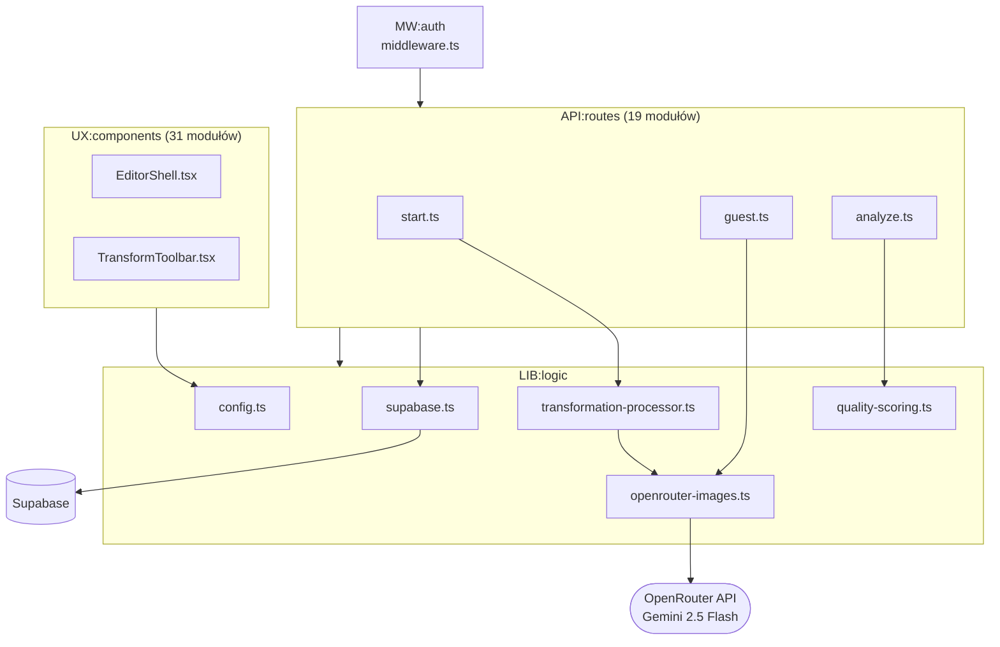

# Repo Map — Omnilister AI

> Synteza trzech artefaktów: `artifact-1-territory.md` (git archaeology), `artifact-2-structure.md` (dep-cruiser), `artifact-3-contributors.md` (kontrybutorzy).
> Okno: ostatnie 12 miesięcy. Data: 2026-06-25. Branch: `UX_REDESIGN`.

---

## 1. TL;DR

Omnilister AI to aplikacja webowa do transformacji zdjęć produktowych za pomocą AI (Gemini 2.5 Flash przez OpenRouter). Stack: Astro + React + Cloudflare Workers + Supabase. Praca koncentruje się w dwóch miejscach: `src/lib` (logika AI pipeline) i `src/components/editor` (UI edytora). Pozostałe foldery są relatywnie stabilne.

Trzy miejsca, gdzie boli: `config.ts` importowany przez wszystkie warstwy (fan-in=15), `supabase.ts` dotykany przez 18 tras bez warstwy serwisowej, oraz trójdzielny AI pipeline z osobną ścieżką dla gości (`guest.ts`), która łatwo „wypadnie" przy zmianie modelu AI.

---

## 2. Teren

### Gdzie skupia się praca

| Folder | Edycje (12 mies.) | Charakter |
|--------|-------------------|-----------|
| `src/lib` | 21 | **Głęboki** — AI pipeline, config, DB client; zmienia się przy każdej integracji |
| `src/components/editor` | 19 | **Głęboki, rosnący** — EditorShell fan-out=9; aktywny WIP na branchu |
| `src/components/transformation` | 8 | Średni — stabilizuje się |
| `src/components/auth` + `src/pages/auth` | 7+5 | Peryferia — napisane raz, rzadko dotykane |
| `src/pages/api/transformations` | 5 | Głęboki punktowo — `start.ts` zmienia się razem z lib |
| `src/types` | 6 | Reaktywny — rośnie przy każdym nowym feature, często regenerowany |

### Moduły głębokie vs płytkie

**Głębokie** (wiele zależności, wysoka aktywność): `config.ts`, `supabase.ts`, `EditorShell.tsx`, `start.ts`, `transformation-processor.ts`.

**Płytkie** (mało zależności, stabilne): `src/pages/auth/*`, `src/components/auth/*`, `src/lib/transformation-styles.ts`.

### Aktywność w czasie

Trzy wyraźne fazy:
1. **Fundament** (commity `94b145d`→`891d507`) — schemat DB, RLS, buckety Storage, scaffold
2. **AI pipeline** (`1469164`→`cb77b4e`) — transformacje, scoring, migracja OpenAI→OpenRouter
3. **Editor UX** (`0ec14f4`→`c6f9630`, aktywna) — redesign UI, model selector, drawer promptów, save/discard

Faza 3 jest niezakończona — branch `UX_REDESIGN` ma niezacommitowane zmiany.

---

## 3. Realne powiązania

### Co zmienia się razem i skąd to wiadomo

| Para / grupa | Siła | Źródło |
|---|---|---|
| `openrouter-images.ts` + `transformation-processor.ts` | **3× co-commit** | git history |
| `config.ts` + każdy plik API | **2× co-commit** | git history |
| `start.ts` + `transformation-processor.ts` + `openrouter-images.ts` | triple 2× | git history |
| `supabase.ts` ← 18 tras API | fan-in=18 | graf importów (dep-cruiser) |
| `config.ts` ← 15 modułów (UI + API + lib) | fan-in=15 | graf importów (dep-cruiser) |
| `EditorShell.tsx` → 9 modułów | fan-out=9 | graf importów (dep-cruiser) |

### Sprzężenia przez regenerację (tanie — nie myl z ręczną edycją)

`src/types/database.generated.ts` — regenerowany 4× przez Supabase CLI, nie edytowany ręcznie. Jego zmiana w historii git **nie oznacza**, że ktoś świadomie modyfikował typy; to efekt `supabase gen types`. Koszt zmiany: uruchomienie komendy, nie refaktor.

### Warstwy bez grafu zależności — `unknown`

Pliki `.astro` (`src/pages/*.astro`, `src/layouts/*.astro`) **nie były objęte skanem dep-cruiser** (brak obsługi rozszerzenia w konfiguracji). Ich powiązania z komponentami React są **nieznane** z grafu. Wiadomo z git, że `0ec14f4` (redesign) dotknął wiele stron Astro jednocześnie — prawdopodobne sprzężenie `src/pages/app/editor.astro` ↔ `EditorShell.tsx`, ale nie potwierdzone grafem.

### Cykle

**Brak.** 0 krawędzi circular w całym `src/` (dep-cruiser, 2026-06-24).

---

## 4. Strefy ryzyka

| # | Strefa | Dlaczego ryzykowna |
|---|--------|-------------------|
| 1 | `src/middleware.ts` | 77 distinct git partners — pojawia się w każdym commicie dotykającym auth+routing+API; zmiana ma ukryty zasięg |
| 2 | `src/lib/config.ts` | fan-in=15, #1 hot file; zmiana kształtu obiektu uderza w 15 modułów bez błędu kompilacji |
| 3 | AI pipeline — `guest.ts` | Omija `transformation-processor`; przy zmianie modelu AI naturalny odruch to aktualizacja procesora — `guest.ts` pozostaje niezmieniony bez żadnego ostrzeżenia |
| 4 | `src/lib/supabase.ts` | fan-in=18, brak warstwy serwisowej; każda potrzeba (mock w testach, multi-tenant, rotacja kluczy) uderza w 18 plików jednocześnie |
| 5 | `src/components/editor/EditorShell.tsx` | fan-out=9, mock data importowany w produkcji (`mockEditorData.ts`), 10 tranzytywnych zależności — najtrudniejszy do testowania komponent w repo |
| 6 | Orphaned WIP w `editor/` | `CategorySelector.tsx`, `EditorHeader.tsx`, `GuardrailBox.tsx` bez importerów — nieznany stan (WIP/placeholder/martwy kod) |

---

## 5. Kogo zapytać

Projekt jest **single-contributor** (bus factor = 1). We wszystkich sześciu strefach ryzyka jedynym kontaktem jest:

**piotrbary** — piotr.barylak@gmail.com

| Strefa | Pytania do piotrbary |
|--------|---------------------|
| `middleware.ts` | Które trasy są chronione i dlaczego; czy jest plan na middleware tests |
| `config.ts` | Które pola są stałymi build-time, które live env; czy planowany `constants.ts` |
| `guest.ts` | Intencja osobnej ścieżki AI dla gości; czy `start.ts` i `guest.ts` mają się scalić |
| `supabase.ts` | Czy planowana warstwa serwisowa; jak testować logikę DB |
| `EditorShell.tsx` | Czy `mockEditorData` jest warunkowo importowany; status trzech orphaned WIP |

---

## 6. Pierwszy dzień — od czego zacząć

Pliki w kolejności od szerokiego obrazu do konkretnych ścieżek:

1. **`src/lib/config.ts`** — zrozumiesz, jakie stałe i klucze środowiskowe trzyma cały system; to punkt wejścia do każdej integracji
2. **`src/middleware.ts`** — dowiesz się, które trasy są chronione i jak działa auth flow; wszystkie API zmiany zaczynają się tutaj
3. **`src/lib/supabase.ts`** — jeden klient Supabase dla całego repo; zrozumiesz pattern dostępu do DB zanim trafisz na konkretne trasy
4. **`src/pages/api/transformations/start.ts`** — główna ścieżka AI (logged-in users); pokazuje jak API route łączy DB + AI pipeline
5. **`src/pages/api/transformations/guest.ts`** — osobna ścieżka AI dla gości, która **nie** przechodzi przez `transformation-processor`; czytaj obok `start.ts`, żeby zobaczyć rozbieżność
6. **`src/lib/transformation-processor.ts`** — rdzeń logiki AI transform; tu żyje integracja z OpenRouter
7. **`src/components/editor/EditorShell.tsx`** — orchestrator całego UI edytora; fan-out=9, sprawdź import `mockEditorData` (warunek czy zawsze?)

---

## 7. Ograniczenia

**Okno czasowe:** git archaeology obejmuje ostatnie 12 miesięcy; dep-cruiser to stan na 2026-06-24. Kod sprzed roku nie jest uwzględniony.

**Metoda:**
- Historia gita: daje aktywność i coupling przez co-change — nie mówi o jakości ani intencji zmiany
- dep-cruiser: daje statyczny graf importów — nie obejmuje plików `.astro` (unknown), nie wykrywa dynamicznych importów (`import()`)
- Typy regenerowane (`database.generated.ts`) wyglądają jak ręczne edycje w historii git — to artefakt, nie sygnał

**Czego mapa NIE mówi:**
- Jak zachowuje się system pod obciążeniem
- Które ścieżki są krytyczne dla użytkownika (brak danych analytics/traces)
- Stan testów — `quality-scoring.test.ts` istnieje, reszta pokrycia nieznana
- Powiązania między stronami `.astro` a komponentami React — te połączenia są `unknown` bez rozszerzenia skanu dep-cruiser o `.astro`
- Czy orphaned WIP komponenty edytora są aktywnie rozwijane przez kogoś poza tym oknem sesji

---

## 8. Runtime Unknowns — gdzie statyczny graf kłamie

Miejsca, gdzie graf importów pokazuje zależność, ale ukrywa rzeczywiste zachowanie w runtime.

### RU-1: Config-driven runtime branching — `openrouter-images.ts`

`generateFull()` wywołuje `TRANSFORMATION_MODELS.find(m => m.id === model)?.supportsImageOutput` w runtime. Jeśli model jest image-native → jeden krok (model generuje obraz bezpośrednio). Jeśli text/vision → dwa kroki (model enhances prompt → Gemini generuje obraz).

Dodanie modelu do tablicy `TRANSFORMATION_MODELS` w `config.ts` **zmienia ścieżkę wykonania**, nie tylko UI. Graf statyczny tego nie pokazuje — widzi tylko import `aiConfig`.

### RU-2: `supabase.ts` zwraca `null` przy braku kluczy

`createClient()` zwraca `null` jeśli `SUPABASE_URL` lub `SUPABASE_KEY` są falsy. Każdy z 18 callerów musi obsłużyć `null` → 503. Graf pokazuje fan-in=18 jako symetryczny, ale każdy caller ma inną obsługę błędu. Niespójność niewidoczna w grafie.

### RU-3: `scorePhoto` w `transformation-processor.ts` jest fire-and-forget

`scorePhoto()` wywoływana w `try { } catch { }` bez rethrow (linia ~118). Błąd scoringu nie blokuje transformacji. Graf statyczny pokazuje twardą zależność `transformation-processor → quality-scoring`, ale semantycznie to zależność opcjonalna. Test który mocka `scorePhoto` jako failing powinien przepuścić transformację.

### RU-4: `MOCK_SCORE_BEFORE` w produkcji — nie jest warunkowy

`EditorShell.tsx` linia 2: `import { MOCK_SCORE_BEFORE } from "@/data/mockEditorData"`. Linia 686: `<ScoreSidebar scoreBefore={MOCK_SCORE_BEFORE} scoreAfter={scoreAfter} />`. Import jest bezwarunkowy, `MOCK_SCORE_BEFORE` (wartość stała `5.8`) jest zawsze przekazywany jako `scoreBefore`. Prawdziwy wynik jakości przed transformacją **nigdy nie trafia do sidebara**. To WIP, nie feature.

### RU-5: `astro:env/server` — klucze środowiskowe poza grafem

`OPENROUTER_API_KEY`, `SUPABASE_URL`, `SUPABASE_KEY` są importowane przez `astro:env/server` — mechanizm Astro, niewidoczny dla dep-cruiser. Dep-cruiser nie śledzi skąd te wartości pochodzą w runtime (Workers Secrets / `.dev.vars`). Rotacja klucza = zmiana wyłącznie w Cloudflare Dashboard, zero zmian w kodzie, ale full restart Workera.

### RU-6: `.astro` pages — powiązania z komponentami React nieznane

Pliki `src/pages/*.astro` i `src/layouts/*.astro` nie były objęte skanem dep-cruiser. Wiadomo z gita, że `editor.astro` renderuje `EditorShell`, ale pełna mapa zależności stron Astro jest `unknown`.

Weryfikacja: `npx depcruise --include-only "^src" --ts-config tsconfig.json --output-type json src | jq` po dodaniu `"extensions": [".astro"]` do `enhancedResolveOptions` w `.dependency-cruiser.cjs`.
