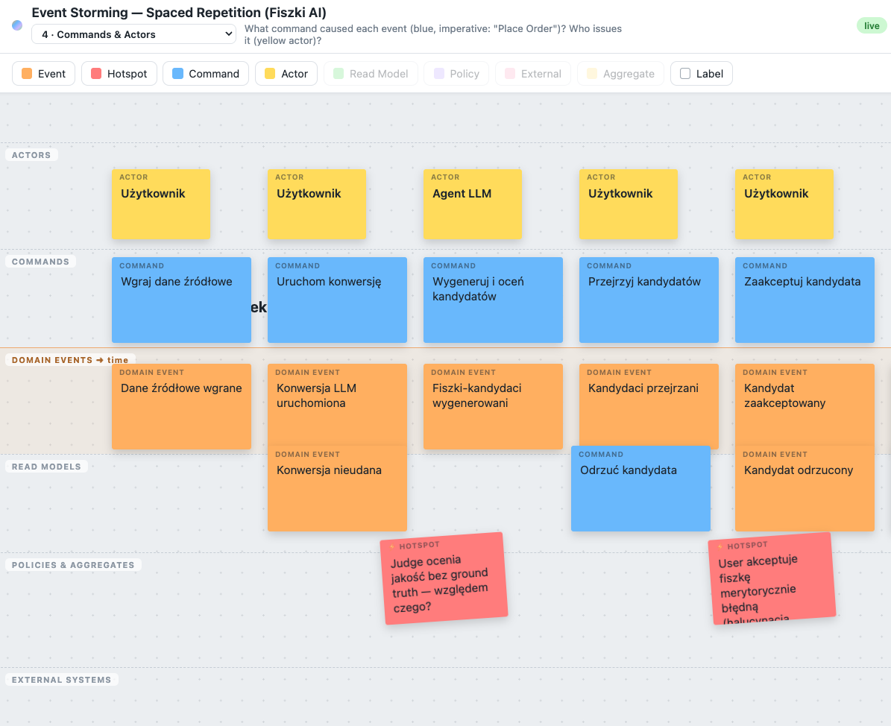

# Event Storming Board 🟧🟦🟪



Małe, **żywe narzędzie do Event Stormingu**, stworzone na potrzeby kursu
**10xDevs 3.0 — AI-Native Software Development**. Człowiek prowadzi warsztat
w przeglądarce, a **agent AID (Claude) współmoderuje** sesję, edytując plik
`board.json`. Tablica odświeża się natychmiast po każdej zmianie. Bez kroku
budowania, bez zależności — czysty Node.js i kilka plików w `public/`.

> Cel dydaktyczny: pokazać wzorzec **AI-Native** — wspólny plik jako jedyne
> źródło prawdy, który równolegle edytują człowiek i agent, a interfejs reaguje
> na zmiany na żywo.


## Po co to jest

Event Storming to technika warsztatowa (autorstwa Alberto Brandoliniego) do
modelowania procesów biznesowych za pomocą kolorowych karteczek. Tutaj robimy to
**razem z agentem**:

- **Ty** prowadzisz warsztat w przeglądarce — dodajesz, przesuwasz i edytujesz
  karteczki, zmieniasz fazy.
- **Agent** czyta i edytuje `board.json`, czyli „myśli na tablicy": dorzuca
  zdarzenia, układa je w czasie, zaznacza ryzyka (hotspoty), zadaje pytania.
- **Tablica** odświeża się na żywo u wszystkich połączonych przeglądarek dzięki
  Server-Sent Events.

To miniaturowy, ale kompletny przykład aplikacji, w której człowiek i model
pracują na **tym samym stanie** w czasie rzeczywistym.

## Uruchomienie

```bash
node server.js
# otwórz http://localhost:4000

# inny port:
PORT=8080 node server.js
```

Potrzebujesz tylko Node.js (bez `npm install` — projekt nie ma zależności).

## Gramatyka Event Stormingu (kolory = znaczenie)

Tablica mówi wizualnym językiem Brandoliniego, a nie generycznymi kształtami.
Każda rola ma stały kolor i swój **pas (swimlane)**:

| kolor       | rola             | znaczenie                                  |
| ----------- | ---------------- | ------------------------------------------ |
| pomarańczowy| Domain Event     | coś się wydarzyło (czas przeszły)          |
| niebieski   | Command          | intencja, która wywołuje zdarzenie         |
| żółty       | Actor            | kto wydaje komendę                         |
| zielony     | Read Model       | informacja potrzebna aktorowi do decyzji   |
| fioletowy   | Policy           | reguła reaktywna („gdy… wtedy…")           |
| różowy      | External         | system spoza domeny                        |
| beżowy      | Aggregate        | encja pilnująca reguł                       |
| czerwony    | Hotspot          | problem, ryzyko lub otwarte pytanie        |

- **Pasy** układają każdą rolę w jej pasmie, a **oś X to czas** — zdarzenia płyną
  od lewej do prawej wzdłuż podświetlonej osi.
- **Selektor faz** (Chaotic Exploration → Timeline → Hotspots → Commands &
  Actors → Read Models/Policies → Aggregates) **blokuje pasek narzędzi**, więc
  dodajesz właściwe karteczki we właściwej kolejności.

## Jak prowadzić warsztat z agentem (przykładowe prompty)

Najlepiej działa krótki dialog: ty mówisz, czego chcesz, agent edytuje
`board.json` i opisuje w czacie, co zrobił. Kilka przykładów:

**Start sesji:**

```
Wyczyść tablicę i poprowadź warsztat Event Storming dla procesu składania
zamówienia w sklepie internetowym. Zacznij od fazy chaotic-exploration.
```

**Faza 1 — burza zdarzeń:**

```
Dorzuć 4–5 przykładowych zdarzeń domenowych dla checkoutu, w czasie przeszłym.
Zostaw między nimi miejsce, żebyśmy potem dodali komendy.
```

**Faza 2 — oś czasu:**

```
Ułóż zdarzenia chronologicznie na osi czasu i scal duplikaty. Gdzie widzisz
luki w procesie?
```

**Faza 3 — hotspoty:**

```
Przejdź do fazy hotspots i zaznacz na czerwono miejsca, w których proces
może się wysypać — błąd płatności, brak towaru, timeout.
```

**Pogłębianie:**

```
Co się dzieje, gdy płatność się nie powiedzie? Dodaj ścieżkę błędu
i komendę ponowienia.
```

```
Dodaj komendy (niebieskie) i aktorów (żółtych) dla każdego zdarzenia
w fazie commands-actors.
```

Agent zawsze najpierw czyta `board.json`, więc buduje na Twoim aktualnym stanie
i nie nadpisuje Twoich karteczek. Pełny protokół moderatora znajdziesz
w `CLAUDE.md` / `AGENTS.md`.

## Praca w przeglądarce

- Wybierz typ karteczki z paska narzędzi.
- Dwuklik, żeby edytować tekst.
- Przeciągnij, żeby ustawić pozycję.
- `Backspace`, żeby usunąć.
- Zmień fazę z listy rozwijanej.

## Jak to działa pod spodem

`board.json` jest **jedynym źródłem prawdy**. `server.js` obserwuje plik
(`fs.watch`) i wysyła każdą zmianę do przeglądarek przez Server-Sent Events;
zmiany z przeglądarki wracają POST-em do tego samego pliku. Architekturę
i schemat JSON opisuje `CLAUDE.md` (§1–§2).

```
        POST /api/board                 fs.watch + SSE
przeglądarka ──────────────▶ board.json ──────────────▶ przeglądarka(i)
                                ▲
        agent edytuje plik ─────┘
```

Sesje są **bezstanowe** — każdy warsztat zaczyna się od pustej tablicy
startowej. Nie ma bazy danych ani historii: tablica to cały stan.

## Źródła i podziękowania

Event Storming to technika warsztatowa stworzona przez **Alberto Brandoliniego**
([@ziobrando](https://twitter.com/ziobrando)). To narzędzie odwzorowuje jego
wizualny język (kolory ról, pasy, oś czasu) — cała zasługa za samą metodę należy
do niego.

- Wprowadzenie do metody: <https://www.eventstorming.com>
- Książka „Introducing EventStorming" (Leanpub): <https://leanpub.com/introducing_eventstorming>

Ten projekt to materiał dydaktyczny kursu **10xDevs 3.0 — AI-Native Software
Development**, niezwiązany oficjalnie z autorem metody.

## Licencja

Kod udostępniony na licencji [MIT](LICENSE).
